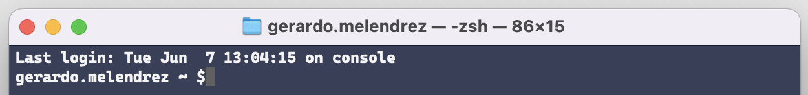

# Table of Contents

- [Table of Contents](#table-of-contents)
  - [Introduction](#introduction)
  - [Prerequisites](#prerequisites)
    - [Windows Prerequisites](#windows-prerequisites)
    - [macOS Prerequisites](#macos-prerequisites)
  - [Demo](#demo)
    - [Oh My Posh Installation on Windows](#oh-my-posh-installation-on-windows)
      - [Install on Windows](#install-on-windows)
      - [Update on Windows](#update-on-windows)
      - [Themes](#themes)
    - [Oh My Posh Installation on macOS](#oh-my-posh-installation-on-macos)
      - [Install on macOS](#install-on-macos)
      - [Update on macOS](#update-on-macos)
    - [Oh My Posh Installation on Linux](#oh-my-posh-installation-on-linux)
      - [Install on Linux](#install-on-linux)
      - [Update on Linux](#update-on-linux)
  - [Summary](#summary)
  - [Complete Instructions](#complete-instructions)
  - [Resources](#resources)

## Introduction

In this demo, I am going to show you how to pimp your terminal, whether you are a PC or Mac developer.

Are you a Windows PC developer and you are not using Windows Terminal, or you have not even heard of it? This demo is for you!

Are you a Mac Developer, and you are using the default `zsh` terminal? this demo is for you!

By "pimp your terminal" I mean making your terminal look on Windows PC from this:

To this:

  

Or on macOS from this:

  

To this:

  

Not only the command prompt will be "Pimped" but also the results on a PC:

From this:

  

To this:

  

So, how do we do it? Let's get started!

## Prerequisites

### Windows Prerequisites

In order to "Pimp your Terminal" on a Windows PC, you will need to forget about our dear "Command Prompt" and download the newest Windows Terminal from the [Windows Store](<https://apps.microsoft.com/store/detail/windows-terminal/9N0DX20HK701?hl=en-us&gl=US>). Alternatively, you can download it directly from GitHub.com, from this [link](<https://github.com/microsoft/terminal/releases>), as Windows Terminal is open source.

You also need to download and install `PowerShell Core` from this [link](<https://apps.microsoft.com/store/detail/powershell/9MZ1SNWT0N5D?hl=en-us&gl=US>).

> :blue_book: The recommended way to install Windows Terminal is from the Windows Store, so you get automatic updates.

### macOS Prerequisites

Windows Terminal is not a cross-platform application, and is not possible to pimp your default `zsh` macOS Terminal, so in order to pimp our terminal in macOS, we need to install `iTerm2` from this [link](<https://iterm2.com>), which is free.

## Demo

The very first time I ever heard from someone talking about taking your terminal to the next level, a few years ago, was from the "third" Microsoft Scott, Scott Hanselman. I recommend you follow his blog [here](<https://www.hanselman.com/blog>). The "first" being "Scott Guthrie", the creator of `ASP.NET Web Forms` and blogging [here](<https://azure.microsoft.com/en-us/blog/author/scott-guthrie/>), and the "second" Scott Hunter, Director Program Management, .NET, which you can also follow his blog [here](<https://devblogs.microsoft.com/dotnet/author/scott-h/>).

In order to "Pimp your Terminal" we are going to use a tool called "Oh My Posh", which works on any shell like `PowerShell` on Windows, or `Bash` shells on WSL (Windows Subsystem for Linux) running Ubuntu.

>:bulb: You can find the official `Oh My Posh!` documentation [here](<https://ohmyposh.dev/docs/>).

### Oh My Posh Installation on Windows

#### Install on Windows

`winget install oh-my-posh`

#### Update on Windows

`winget upgrade oh-my-posh`

#### Themes

`POSH_THEMES_PATH`

### Oh My Posh Installation on macOS

#### Install on macOS

`brew install jandedobbeleer/oh-my-posh/oh-my-posh`

#### Update on macOS

`brew update && brew upgrade oh-my-posh`

### Oh My Posh Installation on Linux

#### Install on Linux

`brew install jandedobbeleer/oh-my-posh/oh-my-posh`

#### Update on Linux

`brew update && brew upgrade oh-my-posh`

## Summary

As you can see, pimping your terminal and make it look awesome, is a very simple process thanks to "Oh My Posh", and it works on Windows, macOS and Linux. Give it a try!

For more information, take a look at the resources below.

## Complete Instructions

The complete instructions for this demo can be found in the link below.

- <https://github.com/payini/PimpMyTerminal>

## Resources

| Resource Title                                                         | Url                                                                                                     |
| ---------------------------------------------------------------------- | ------------------------------------------------------------------------------------------------------- |
| Install and get started setting up Windows Terminal                    | <https://docs.microsoft.com/en-us/windows/terminal/install>                                             |
| iTerm2                                                                 | <https://iterm2.com>                                                                                    |
| Oh My Posh                                                             | <https://ohmyposh.dev/>                                                                                 |
| Nerd Fonts                                                             | <https://www.nerdfonts.com/>                                                                            |
| Scott Guthrie's Blog                                                   | <https://azure.microsoft.com/en-us/blog/author/scott-guthrie/>                                          |
| Scott Hunter's Blog                                                    | <https://devblogs.microsoft.com/dotnet/author/scott-h>                                                  |
| Scott Hanselman's Blog                                                 | <https://www.hanselman.com/blog>                                                                        |
| My Ultimate PowerShell prompt with Oh My Posh and the Windows Terminal | <https://www.hanselman.com/blog/my-ultimate-powershell-prompt-with-oh-my-posh-and-the-windows-terminal> |
